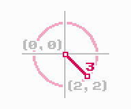

# euclidean
> Calculate the [Euclidean distance](https://en.wikipedia.org/wiki/Euclidean_distance) between two points



This module exposes the function `distance(a, b)`, which determines the Euclidean distance between points `a` and `b`.
```js
> const distance = require('euclidean')
> distance([0, 0], [2, 2])
3
```

[](https://www.npmjs.com/package/euclidean)

## see also
- [`semibran/manhattan`](https://github.com/semibran/manhattan) - calculate Manhattan distance
- [`semibran/chebyshev`](https://github.com/semibran/chebyshev) - calculate Chebyshev distance
- [`semibran/vector`](https://github.com/semibran/vector) - more vector math

## license
[MIT](https://opensource.org/licenses/MIT) © [Brandon Semilla](https://git.io/semibran)
